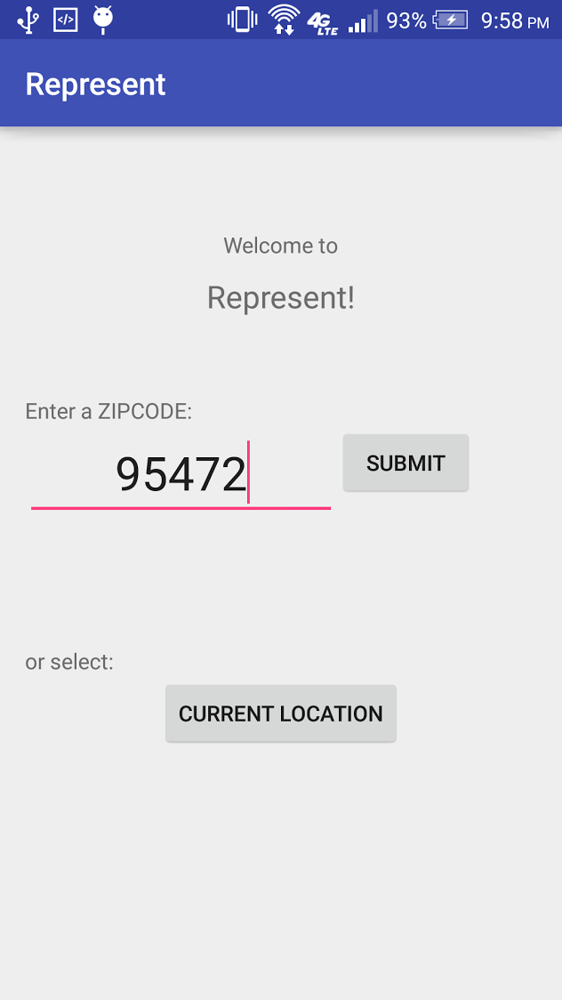
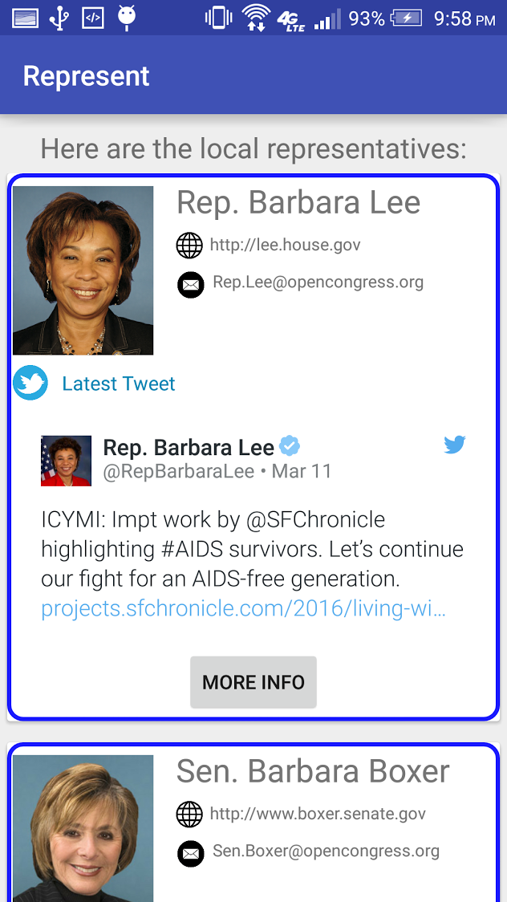

# PROG 02: Represent!

You can input location by zipcode and see the local representatives of the area. 

## Authors

Jessica Xu ([jcxu@berkeley.edu](mailto:your_email@berkeley.edu))

## Demo Video

See [your demo video title here](https://youtu.be/Y8IayJf2Sxc)

## Screenshots

## Acknowledgments

* Hat tip to anyone who's code was used
* Any other support
